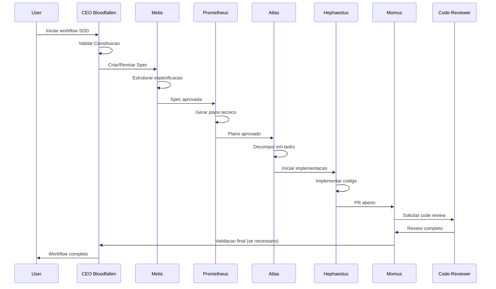

# Mapeamento de Agentes Paperclip para Fases SDD

> **Fonte da Verdade:** Este documento mapeia os 17+ agentes do Paperclip às fases do Spec-Driven Development (SDD).
> Consulte `SDD-GUIA.md` para detalhes completos das fases SDD.

---

## Visao Geral

O Spec-Driven Development (SDD) divide o ciclo de desenvolvimento em 6 fases distintas. Cada fase possui agentes Paperclip especificos responsaveis por sua execucao, com agentes de suporte para tarefas auxiliares.

```
┌─────────────────────────────────────────────────────────────────────────────┐
│                        FLUXO SDD COM AGENTES                                 │
├─────────────────────────────────────────────────────────────────────────────┤
│                                                                              │
│  CONSTITUICAO ──► SPEC ──► PLANO ──► TASKS ──► IMPLEMENTACAO ──► QUALITY    │
│       │            │          │         │            │              │       │
│       ▼            ▼          ▼         ▼            ▼              ▼       │
│   CEO/Oracle   Metis/Libra  Prom/Atlas  Atlas   Hephaestus/Sr  Code-Rev/    │
│   Architect    Explore                 Par-Work    Coder        Momus       │
│                                                                              │
└─────────────────────────────────────────────────────────────────────────────┘
```

---

## Fase 1: Constituicao

### Objetivo
Validar que todas as operacoes respeitam os principios inegociaveis do projeto (`CONSTITUICAO.md`).

### Agente Primario

| Agente | Modelo | Responsabilidade |
|--------|--------|------------------|
| **CEO Bloodfallen** | glm-5 | Supervisionar e validar conformidade com principios do projeto |

### Agentes de Suporte

| Agente | Modelo | Responsabilidade |
|--------|--------|------------------|
| **Architect** | glm-5 | Validar decisoes arquiteturais contra constituicao |
| **Oracle** | glm-5 | Consulta read-only para verificar conformidade historica |

### Gatilho de Ativacao
- Inicio de qualquer workflow de desenvolvimento
- Antes de processar qualquer spec ou implementacao
- Quando uma mudanca arquitetural e proposta

### Criterios de Saida
- [ ] Principios da constituicao validados
- [ ] Nenhuma violacao detectada
- [ ] Decisoes arquiteturais documentadas
- [ ] Aprovacao do CEO para prosseguir

### Fluxo de Execucao
```
1. CEO Bloodfallen carrega CONSTITUICAO.md
2. Architect valida contexto tecnico atual
3. Oracle consulta historico de conformidade
4. CEO aprova ou bloqueia operacao
```

---

## Fase 2: Especificacao (Spec)

### Objetivo
Criar ou revisar especificacoes (issues) seguindo o template `ISSUE_TEMPLATE.md`.

### Agente Primario

| Agente | Modelo | Responsabilidade |
|--------|--------|------------------|
| **Metis** | glm-5 | Analise pre-planejamento e estruturacao de specs |

### Agentes de Suporte

| Agente | Modelo | Responsabilidade |
|--------|--------|------------------|
| **Librarian** | glm-5 | Pesquisar documentacao externa e referencias |
| **Explore** | glm-5 | Explorar codebase para contexto tecnico |
| **Oracle** | glm-5 | Consultoria read-only para duvidas de especificacao |

### Gatilho de Ativacao
- Issue criada sem descricao adequada
- Issue com descricao incompleta ou superficial
- Mensagem do Discord que requer criacao de issue
- Solicitacao de nova feature

### Criterios de Saida
- [ ] Descricao tecnica completa
- [ ] Contexto e motivacao documentados
- [ ] Criterios de aceitacao definidos
- [ ] Analise tecnica com possiveis causas
- [ ] Arquivos afetados mapeados
- [ ] Labels apropriadas aplicadas

### Fluxo de Execucao
```
1. Metis recebe solicitacao de spec
2. Explore investiga codebase relacionado
3. Librarian pesquisa referencias externas
4. Metis estrutura spec seguindo ISSUE_TEMPLATE.md
5. Oracle valida qualidade da spec
6. Spec publicada/Atualizada no GitHub
```

---

## Fase 3: Plano Tecnico

### Objetivo
Decompor a spec em plano tecnico com tarefas atomicas e sequenciamento.

### Agente Primario

| Agente | Modelo | Responsabilidade |
|--------|--------|------------------|
| **Prometheus** | glm-5 | Planejamento e decomposicao de tarefas |

### Agentes de Suporte

| Agente | Modelo | Responsabilidade |
|--------|--------|------------------|
| **Atlas** | glm-5 | Coordenacao e priorizacao de tarefas |
| **Architect** | glm-5 | Validar plano contra arquitetura existente |
| **Reasoning-Specialist** | glm-5 | Analise de dependencias complexas |

### Gatilho de Ativacao
- Spec aprovada e pronta para implementacao
- Necessidade de refinar plano existente
- Mudanca de escopo que requer re-planejamento

### Criterios de Saida
- [ ] Plano tecnico detalhado
- [ ] Tarefas decompostas em unidades atomicas
- [ ] Dependencias identificadas
- [ ] Sequenciamento logico definido
- [ ] Riscos mapeados
- [ ] Estimativa de esforco

### Fluxo de Execucao
```
1. Prometheus analisa spec completa
2. Architect valida viabilidade arquitetural
3. Reasoning-Specialist analisa dependencias complexas
4. Prometheus gera plano decomposto
5. Atlas prioriza e sequencia tarefas
6. Plano documentado na secao IMPLEMENTACAO SUGERIDA
```

---

## Fase 4: Decomposicao em Tasks

### Objetivo
Converter plano tecnico em checklist de tarefas executaveis.

### Agente Primario

| Agente | Modelo | Responsabilidade |
|--------|--------|------------------|
| **Atlas** | glm-5 | Coordenacao e decomposicao de tarefas |

### Agentes de Suporte

| Agente | Modelo | Responsabilidade |
|--------|--------|------------------|
| **Parallel-Worker** | glm-5-turbo | Identificar tarefas paralelizaveis |
| **Prometheus** | glm-5 | Consultoria em decomposicao |

### Gatilho de Ativacao
- Plano tecnico aprovado
- Necessidade de quebrar tarefas em sub-tarefas
- Identificacao de oportunidades de paralelizacao

### Criterios de Saida
- [ ] Checklist de tarefas criado
- [ ] Cada tarefa e atomica e executavel
- [ ] Tarefas paralelizaveis identificadas
- [ ] Dependencias entre tarefas mapeadas
- [ ] Ordem de execucao definida

### Fluxo de Execucao
```
1. Atlas recebe plano tecnico
2. Parallel-Worker identifica tarefas independentes
3. Atlas cria checklist detalhado
4. Dependencias mapeadas
5. Checklist adicionado a issue/PR
```

---

## Fase 5: Implementacao

### Objetivo
Executar as tarefas e produzir codigo seguindo os padroes do projeto.

### Agente Primario

| Agente | Modelo | Responsabilidade |
|--------|--------|------------------|
| **Hephaestus** | glm-5 | Implementacao e construcao de codigo |

### Agentes de Suporte

| Agente | Modelo | Responsabilidade |
|--------|--------|------------------|
| **Senior-Coder** | glm-5 | Implementacao de codigo complexo |
| **Parallel-Worker** | glm-5-turbo | Execucao paralela de tarefas independentes |
| **Quick-Fixer** | glm-4.7 | Correcoes triviais e ajustes simples |
| **Multimodal-Looker** | glm-5 | Analise visual/UI de componentes |
| **Test-Writer** | glm-5 | Criacao de testes para implementacao |
| **Explore** | glm-5 | Consulta de padroes existentes no codebase |

### Gatilho de Ativacao
- Checklist de tarefas aprovado
- Branch criada para implementacao
- Correcao de PR com mudancas solicitadas

### Criterios de Saida
- [ ] Codigo implementado seguindo padroes
- [ ] TypeScript strict sem erros
- [ ] Lint aprovado
- [ ] Testes criados/executados
- [ ] Commits seguindo COMMIT-PATTERN.md
- [ ] Imports nao utilizados removidos

### Fluxo de Execucao
```
1. Hephaestus inicia implementacao
2. Explore consulta padroes existentes
3. Parallel-Worker executa tarefas independentes em paralelo
4. Senior-Coder assume tarefas complexas
5. Quick-Fixer aplica correcoes triviais
6. Multimodal-Looker valida aspectos visuais (se UI)
7. Test-Writer cria testes
8. Validacao: lint, type-check, testes
9. Commits gerados com padrao gitmoji
```

---

## Fase 6: Quality Gate

### Objetivo
Validar que a implementacao corresponde a spec e respeita a constituicao.

### Agente Primario

| Agente | Modelo | Responsabilidade |
|--------|--------|------------------|
| **Momus** | glm-5 | Revisao de plano e quality gate |

### Agentes de Suporte

| Agente | Modelo | Responsabilidade |
|--------|--------|------------------|
| **Code-Reviewer** | glm-5 | Code review detalhado |
| **Test Agent** | glm-4.7 | Execucao de testes automatizados |
| **Oracle** | glm-5 | Consultoria read-only para duvidas |
| **CEO Bloodfallen** | glm-5 | Aprovacao final (se necessario) |

### Gatilho de Ativacao
- PR aberto para revisao
- PR revisado ha mais de 2 horas
- Necessidade de re-validacao pos-correcao

### Criterios de Saida
- [ ] Spec vs Codigo: consistencia validada
- [ ] Todos os objetivos da spec implementados
- [ ] Nenhum principio da constituicao violado
- [ ] Code review completo
- [ ] Testes passando
- [ ] Padroes de codigo verificados
- [ ] PR aprovado ou mudancas solicitadas

### Fluxo de Execucao
```
1. Momus inicia quality gate
2. Code-Reviewer realiza code review
3. Test Agent executa suite de testes
4. Momus compara spec com implementacao
5. Oracle consultado para duvidas complexas
6. CEO Bloodfallen acionado se conflito grave
7. Decisao: APROVADO | MUDANCAS_SOLICITADAS | REJEITADO
```

---

## Matriz de Responsabilidades

| Agente | Constituicao | Spec | Plano | Tasks | Implementacao | Quality |
|--------|:------------:|:----:|:-----:|:-----:|:-------------:|:-------:|
| CEO Bloodfallen | **PRIMARIO** | - | - | - | - | SUPORTE |
| Architect | SUPORTE | - | SUPORTE | - | - | - |
| Atlas | - | - | SUPORTE | **PRIMARIO** | - | - |
| Code-Reviewer | - | - | - | - | - | SUPORTE |
| Explore | - | SUPORTE | - | - | SUPORTE | - |
| Hephaestus | - | - | - | - | **PRIMARIO** | - |
| Librarian | - | SUPORTE | - | - | - | - |
| Metis | - | **PRIMARIO** | - | - | - | - |
| Momus | - | - | - | - | - | **PRIMARIO** |
| Multimodal-Looker | - | - | - | - | SUPORTE | - |
| Oracle | SUPORTE | SUPORTE | - | - | - | SUPORTE |
| Parallel-Worker | - | - | - | SUPORTE | SUPORTE | - |
| Prometheus | - | - | **PRIMARIO** | - | - | - |
| Quick-Fixer | - | - | - | - | SUPORTE | - |
| Reasoning-Specialist | - | - | SUPORTE | - | - | - |
| Senior-Coder | - | - | - | - | SUPORTE | - |
| Test Agent | - | - | - | - | - | SUPORTE |
| Test-Writer | - | - | - | - | SUPORTE | - |

---

## Orquestracao Sequencial

### Fluxo Padrao SDD

```
┌──────────────────────────────────────────────────────────────────────────┐
│                         ORQUESTRACAO SEQUENCIAL                           │
├──────────────────────────────────────────────────────────────────────────┤
│                                                                           │
│  1. INICIALIZACAO                                                         │
│     └─► CEO Bloodfallen carrega CONSTITUICAO.md                          │
│     └─► Architect valida arquitetura atual                               │
│                                                                           │
│  2. CONSTITUICAO                                                          │
│     └─► CEO Bloodfallen aprova conformidade                              │
│     └─► Oracle consulta historico                                         │
│                                                                           │
│  3. SPEC                                                                  │
│     └─► Metis estrutura spec                                              │
│     └─► Explore investiga codebase ─────► (paralelo)                     │
│     └─► Librarian pesquisa refs ────────► (paralelo)                     │
│     └─► Oracle valida qualidade                                           │
│                                                                           │
│  4. PLANO                                                                 │
│     └─► Prometheus gera plano tecnico                                     │
│     └─► Architect valida viabilidade ───► (paralelo)                     │
│     └─► Reasoning-Specialist analise deps (paralelo)                     │
│     └─► Atlas prioriza tarefas                                            │
│                                                                           │
│  5. TASKS                                                                 │
│     └─► Atlas cria checklist                                              │
│     └─► Parallel-Worker identifica paralelizaveis                         │
│                                                                           │
│  6. IMPLEMENTACAO                                                         │
│     └─► Hephaestus inicia implementacao                                   │
│     └─► Parallel-Worker executa tarefas independentes                     │
│     └─► Senior-Coder assume complexas                                     │
│     └─► Quick-Fixer corrige triviais                                      │
│     └─► Multimodal-Looker valida UI (se aplicavel)                        │
│     └─► Test-Writer cria testes                                           │
│                                                                           │
│  7. QUALITY GATE                                                          │
│     └─► Momus inicia validacao                                            │
│     └─► Code-Reviewer faz review                                          │
│     └─► Test Agent executa testes                                         │
│     └─► Momus compara spec vs codigo                                      │
│     └─► CEO Bloodfallen aprovacao final (se conflito)                     │
│                                                                           │
│  8. MERGE ou RETORNO                                                      │
│     └─► Se aprovado: PR merged                                            │
│     └─► Se rejeitado: retorna para Implementacao                          │
│                                                                           │
└──────────────────────────────────────────────────────────────────────────┘
```

### Sequencia de Chamadas Entre Agentes



---

## Modelos por Tipo de Tarefa

| Tipo de Tarefa | Modelo Recomendado | Agentes |
|----------------|-------------------|---------|
| Analise complexa | glm-5 | CEO, Architect, Metis, Prometheus, Momus |
| Implementacao | glm-5 | Hephaestus, Senior-Coder |
| Execucao rapida | glm-5-turbo | Parallel-Worker |
| Correcoes triviais | glm-4.7 | Quick-Fixer, Test Agent |
| Consultoria read-only | glm-5 | Oracle, Librarian |
| Analise visual | glm-5 | Multimodal-Looker |

---

## Regras de Orquestracao

### Prioridade de Agentes
1. **CEO Bloodfallen**: Sempre envolvido em decisoes criticas
2. **Agentes Primarios**: Executam a tarefa principal da fase
3. **Agentes de Suporte**: Executam em paralelo quando possivel
4. **Oracle**: Sempre disponivel para consultoria read-only

### Paralelismo
- **Sim**: Explore + Librarian (fase Spec)
- **Sim**: Architect + Reasoning-Specialist (fase Plano)
- **Sim**: Hephaestus + Senior-Coder + Quick-Fixer (fase Implementacao)
- **Nao**: Momus + Code-Reviewer (Quality Gate sequencial)

### Tratamento de Conflitos
```
SE conflito entre agentes:
  1. Oracle consultado para opiniao imparcial
  2. CEO Bloodfallen toma decisao final
  3. Decisao documentada para referencia futura
```

### Fallback
```
SE agente primario indisponivel:
  1. Tentar agente de suporte equivalente
  2. Se nao houver, escalar para CEO Bloodfallen
  3. Documentar motivo da substituicao
```

---

## Referencias

| Arquivo | Descricao |
|---------|-----------|
| `SDD-GUIA.md` | Guia completo do Spec-Driven Development |
| `CONSTITUICAO.md` | Principios inegociaveis do projeto |
| `GERENCIADOR.MD` | Workflow principal |
| `ISSUE_TEMPLATE.md` | Template para especificacoes |
| `COMMIT-PATTERN.md` | Padrao de commits (gitmoji) |
| `PULL_REQUEST_REVIEW.md` | Guia de code review |

---

## Historico de Versoes

| Versao | Data | Alteracao |
|--------|------|-----------|
| 1.0.0 | 2026-04-05 | Versao inicial do mapeamento |

---

**Nota:** Este documento deve ser atualizado sempre que novos agentes forem adicionados ou quando as fases SDD forem modificadas. Consulte sempre `SDD-GUIA.md` como fonte da verdade para definicao das fases.
